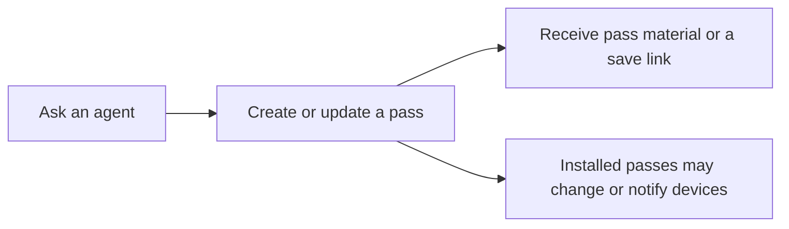
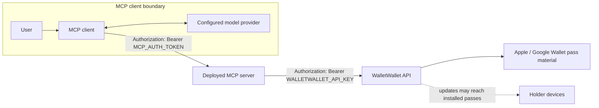

# walletwallet-mcp

`walletwallet-mcp` lets an MCP-capable agent create and update Apple/Google Wallet passes, retrieve Google Wallet save links, and inspect WalletWallet API usage. It is a small, self-hosted bridge to the [WalletWallet API](https://www.walletwallet.dev/docs/), not a pass store or an authorization service.



> [!WARNING]
> This is a single-user prototype. One shared bearer token grants every tool; there is no per-user identity, per-tool scope, rate limit, confirmation gate, or audit trail.

## Architecture and trust boundaries



Tool arguments and results can pass through both the MCP client and its configured model provider. Review their retention, logging, and data-use settings before sending pass or customer data. The MCP bearer token stops unauthenticated HTTP requests at this server; it is never forwarded to WalletWallet. The separate WalletWallet API key is held by the server and sent only to the upstream API.

## Tool safety

| Tool | Classification | External effect |
| --- | --- | --- |
| `create_pass` | **Mutating** | Creates usable pass material and consumes API quota. |
| `update_pass` | **Mutating** | Changes an existing pass; changed fields with `changeMessage` may notify every device where it is installed. An identical body is an upstream no-op. |
| `get_google_wallet_link` | Read-only | Retrieves the save URL for an existing pass; does not change it. |
| `check_usage` | Read-only | Reads current account usage/quota. |

Treat returned serial numbers, barcode values, customer fields, save URLs, and base64 `.pkpass` data as potentially sensitive. Do not put either secret—or sensitive pass data—in chat, tool arguments unnecessarily, source control, container image layers, or ordinary logs. Review every `create_pass` and `update_pass` call as a consequential external action.

Upstream non-success responses are surfaced as tool errors by `httpx`. `get_google_wallet_link` returns the upstream `Location` for a redirect without following it; a non-redirect success is returned as text.

## Install from source

Requirements: Git and Python 3.12+.

```bash
git clone https://github.com/dhk/walletwallet-mcp.git
cd walletwallet-mcp
python3 -m venv .venv
source .venv/bin/activate
python -m pip install --upgrade pip
python -m pip install -r requirements.txt
cp .env.example .env
```

Edit `.env` locally, then export it without printing the values:

```bash
set -a
source .env
set +a
python server.py
```

The streamable-HTTP endpoint is `http://localhost:8000/mcp`. Generate a strong, independent MCP token (for example, `openssl rand -hex 32`); obtain the API key from WalletWallet. Never reuse one as the other.

## Run with Docker

```bash
docker build -t walletwallet-mcp:local .
docker run --rm -p 127.0.0.1:8000:8000 \
  --env-file .env \
  walletwallet-mcp:local
```

Binding to `127.0.0.1` keeps this first run local. For internet deployment, terminate TLS at a trusted proxy/platform and see the explicitly non-canonical [provider templates](docs/deployment.md).

## Verify safely (no WalletWallet calls)

The automated suite uses placeholder secrets and mocked upstream responses. It checks startup configuration, missing/wrong bearer-token rejection, authenticated middleware access, request construction, redirects, and error propagation:

```bash
python -m unittest discover -s tests -v
```

This command makes no live WalletWallet requests and needs no production credentials. You can also start locally with placeholders to verify startup and authentication; do not invoke a tool because placeholders cannot authenticate upstream:

```bash
WALLETWALLET_API_KEY=test-not-real MCP_AUTH_TOKEN=test-not-real python server.py
curl -i http://localhost:8000/mcp
curl -i -H 'Authorization: Bearer wrong' http://localhost:8000/mcp
```

Both requests should return `401`. Authenticated MCP initialization is a protocol request, so use an MCP inspector/client with the endpoint and correct header; the automated test exercises the same authenticated route without an upstream call.

### Opt-in live smoke test (consequential)

Only after the mocked checks pass, connect an MCP client to the local endpoint with real secrets. Start with `check_usage` (read-only). Calling `create_pass` is a separate, explicit live test: it consumes quota, creates usable pass material, and can expose supplied fields and results to the MCP client/model provider. Use synthetic data and delete local outputs when done. There is deliberately no automated live test or “free” create-pass probe.

## Operate safely

- Use HTTPS for every non-local endpoint; never send the bearer token over plaintext transport.
- Store both secrets in the deployment platform's secret manager, restrict operator access, and ensure request/body/header logging is disabled or redacted at the client, proxy, platform, and application layers.
- Rotate `MCP_AUTH_TOKEN` and `WALLETWALLET_API_KEY` independently. Because the MCP token is coarse-grained, rotation revokes every connected client.
- If either token or pass data may be exposed, revoke/rotate credentials, stop or isolate the service, inspect provider/access logs for misuse, assess affected passes and holders, and notify affected parties as appropriate.
- Do not expose this prototype to multiple untrusted users. OAuth, multitenancy, rate limiting, and durable audit logs are outside its scope.

See [SECURITY.md](SECURITY.md) for reporting vulnerabilities and [CONTRIBUTING.md](CONTRIBUTING.md) for the development workflow.
